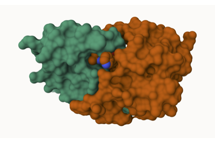
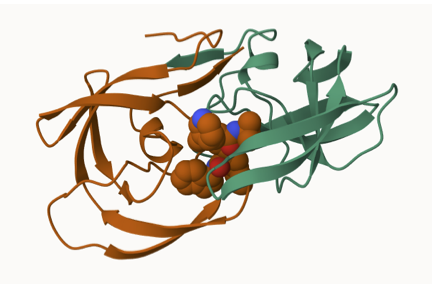

---
title: "class-10"
format: pdf 
author: "Zahra Rashidi (A19561538)"
--- 


**PDB statistics**
The Protein Data Bank (PDB) is the main repository of biomolecular structures. Let’s see what it contains: 

```{r}
stats <- read.csv("Data_Export_Summary.csv")
stats
```
```{r}
stats$X.ray
```


```{r}
sum(stats$Neutron)
```

The comma in these numbers leads to the numbers here being read as character.  


```{r}
library(readr)
stats <- read_csv("Data_Export_Summary.csv")

```
```{r}
stats
```

>Q1: What percentage of structures in the PDB are solved by X-Ray and Electron Microscopy. 

```{r}
total_structures <- sum(stats$Total)
xray_percent <- sum(stats$`X-ray`) / total_structures * 100
em_percent <- sum(stats$EM) / total_structures * 100
xray_percent
```

```{r}
em_percent
```

>Q2: What proportion of structures in the PDB are protein? 


```{r}
protein_percent <- stats$Total[stats$`Molecular Type` == "Protein (only)"] /
  sum(stats$Total) * 100
protein_percent
```

Q3: Skip... Looking up HIV structures including 1HSG

**Visualizing the HIV-1 protease structure**
We can use the Molstar viewer online: https://molstar.org/viewer/. 



Figure 1. HIV-1 protease shown in surface representation, highlighting ligand binding. 

Figure 2. HIV-1 protease (HSG) showing a conserved water molecule. 

**Bio3D package for structural bioinformatics** 

```{r}
library(bio3d)
pdb <- read.pdb("1hsg")
```

```{r}
pdb
```
```{r}
head(pdb$atom)
```

>Q7: How many amino acid residues are there in this pdb object? 

The PDB object contains 198 amino acid residues. 

>Q8: Name one of the two non-protein residues? 

They are HOH and MK1

>Q9: How many protein chains are in this structure?

 There are 2 protein chains in this structure. 
 
#library(bio3dview)
#view.pdb(pdb)

#sele <- atom.select(pdb, resno=25)
# and highlight them in spacefill representation
# view.pdb(pdb, cols=c("navy","teal"),
#        highlight = sele,
#        highlight.style = "spacefill") 


**Predicting functional motions of a single structure**
Read an ADK structure from the PDB database: 

```{r}
adk <- read.pdb("6s36")
```


```{r}

adk
```
```{r}
# Perform flexiblity prediction
m <- nma(adk)
```
```{r}
plot(m)
```
Write out our results as a wee trajectory/movie of predicted motions: 
```{r}
mktrj(m, file="adk_m7.pdb")
```

